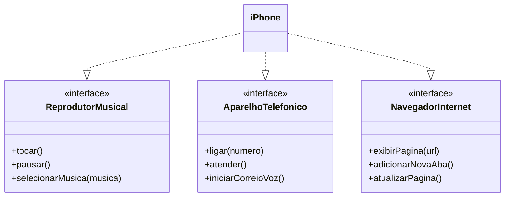

# Desafio - Diagramação de classes do Iphone - Trilha Java Básico

### Classes JAVA reprentando o diagram UML
Implementação das classes Java representadas no diagrama UML

ModelagemDiagramacaoIPhone>src>TesteIphone.java

##
### Diagrama UML (Mermaid)

