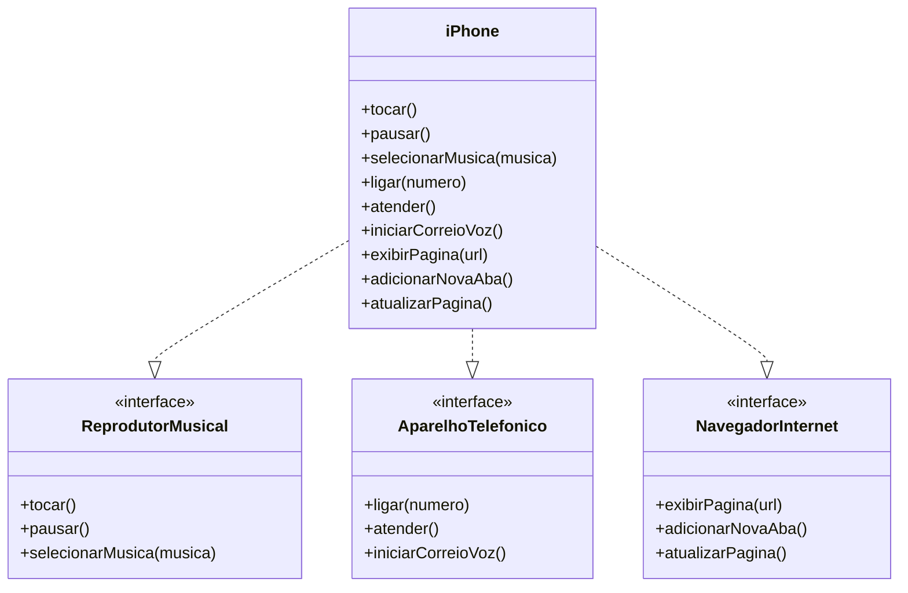

### Diagrama UML (Mermaid)

```mermaid
classDiagram
    %% Interfaces
    class ReprodutorMusical {
      <<interface>>
      +tocar()
      +pausar()
      +selecionarMusica(musica)
    }
    class AparelhoTelefonico {
      <<interface>>
      +ligar(numero)
      +atender()
      +iniciarCorreioVoz()
    }
    class NavegadorInternet {
      <<interface>>
      +exibirPagina(url)
      +adicionarNovaAba()
      +atualizarPagina()
    }

    %% Main class
    class iPhone {
      +tocar()
      +pausar()
      +selecionarMusica(musica)
      +ligar(numero)
      +atender()
      +iniciarCorreioVoz()
      +exibirPagina(url)
      +adicionarNovaAba()
      +atualizarPagina()
    }

    %% Relationships (realizations)
    iPhone ..|> ReprodutorMusical
    iPhone ..|> AparelhoTelefonico
    iPhone ..|> NavegadorInternet
```